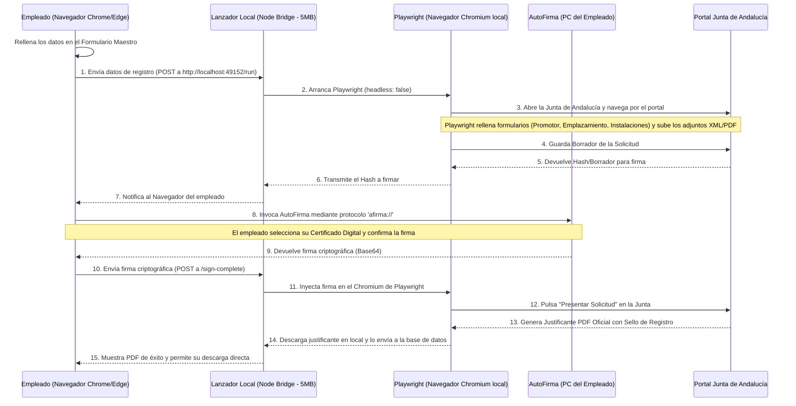

# 🔌 Arquitectura de Firma Desacoplada y Lanzador Local (Opción 3)

Este documento detalla la arquitectura técnica elegida para ejecutar el **Robot de Automatización de Registro CEE (Junta de Andalucía)** desde una aplicación web centralizada (desplegada en la nube/Vercel) pero con visualización e interacción de firma digital **en el ordenador físico del empleado**.

---

## 🏗️ 1. Concepto y Motivación

Al desplegar una aplicación con automatizaciones de Playwright en servidores Serverless (como Vercel), nos enfrentamos a dos problemas críticos:
1. **Límites de tiempo (Timeout)**: Vercel corta las ejecuciones a los 10-15 segundos, mientras que la web de la Junta tarda entre 1 y 2 minutos en procesar el registro.
2. **Acceso al Certificado Digital local**: Playwright ejecutándose en la nube no tiene acceso físico al llavero de certificados del ordenador del empleado, ni a la aplicación nativa **AutoFirma** instalada en su sistema operativo.

### La Solución Ganadora: **Lanzador Local Ultra-ligero + Web**
El empleado trabaja sobre la interfaz Web centralizada. Cuando pulsa el botón de registrar, la web le envía una señal a un **pequeño servicio local (lanzador)** instalado en el PC del empleado. Este lanzador despierta a Playwright localmente en modo visual (`headless: false`), ejecutando todo el trámite ante sus ojos y comunicándose de forma transparente con su **AutoFirma** local.

---

## 🔄 2. Diagrama de Secuencia del Flujo

El siguiente diagrama ilustra el flujo de comunicación entre el navegador del empleado, el lanzador local, el robot de Playwright y el portal de la Junta de Andalucía:

---

## 💻 3. Componentes del Sistema

### A. Frontend (Navegador del Empleado)
* **Función**: Muestra la interfaz del formulario y gestiona el flujo de estados mediante un modal visual de progreso (*"Conectando con lanzador..."*, *"Rellenando Junta..."*, *"Esperando firma..."*).
* **Llamada a AutoFirma**: Usa la librería oficial `AutoFirmaJS` para lanzar la ventana local de firma a través del protocolo del sistema operativo `afirma://`.

### B. Lanzador Local (Local Bridge)
* **Qué es**: Un script ejecutable ultra-ligero desarrollado en Node.js que se empaqueta en un instalador de pocos megabytes (utilizando `pkg` o ejecutándose como un servicio en segundo plano).
* **Puerto Local**: Escucha peticiones locales en un puerto seguro dedicado (por ejemplo, `localhost:49152`).
* **Función**: Al recibir los datos del frontend, inicializa Playwright y le pasa las credenciales y rutas de archivos locales.

### C. Playwright (Motor de Automatización)
* **Configuración**: Se ejecuta con la opción `{ headless: false, channel: 'chrome' }` en la máquina local.
* **Ventaja**: Al ejecutarse localmente, Chromium detecta los certificados instalados en el sistema operativo del empleado para los accesos.

---

## 🔒 4. Seguridad e Integridad de Datos

Esta arquitectura garantiza el máximo nivel de seguridad exigido por el Reglamento General de Protección de Datos (RGPD) y los estándares de firma electrónica:

* **Privacidad del Certificado**: La clave privada del certificado digital **nunca se sube al servidor** ni viaja por internet. La firma se calcula localmente dentro del ordenador del empleado mediante el software seguro oficial de la Administración (AutoFirma).
* **Firma Legal**: La firma resultante se genera cumpliendo los estándares XAdES/CAdES exigidos por la Junta de Andalucía.
* **Actualización del Código**: Dado que el código de la lógica del formulario vive en el Servidor Web (GitHub), cualquier cambio de diseño, normativas o campos nuevos impacta de inmediato a todos los empleados sin necesidad de reinstalar el lanzador local.

---

## ⚙️ 5. Guía de Instalación para Nuevos Empleados

Para que un empleado pueda usar el Registro Automatizado en su puesto de trabajo, solo debe seguir estos pasos una única vez:

1. **Instalar AutoFirma**:
   * Descargar e instalar la última versión oficial desde el portal del Gobierno: [Firma Electrónica - AutoFirma](https://firmaelectronica.gob.es/Home/Descargas.html).
2. **Descargar el Lanzador Local**:
   * Descargar el archivo `.bat` (Windows) o `.sh` (Linux/Mac) provisto por el administrador de sistemas (peso inferior a 5MB).
3. **Ejecutar el Lanzador**:
   * Hacer doble clic sobre el archivo descargado. Se abrirá una pequeña ventana en segundo plano que indicará: `Servidor de automatización activo en http://localhost:49152`.
4. **Comenzar a Tramitar**:
   * Entrar a la web de la empresa y hacer clic en *"Lanzar Registro CEE"*.

---
*Manual de Arquitectura creado el 22 de Julio de 2026.*
